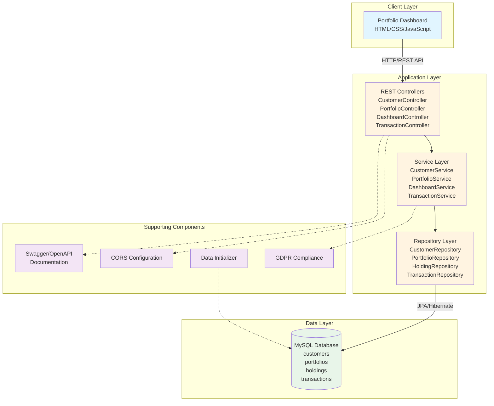

# Architecture Diagram

```mermaid
graph TB
    subgraph "Client Layer"
        A[Portfolio Dashboard<br/>HTML/CSS/JavaScript]
    end
    
    subgraph "Application Layer"
        B[REST Controllers<br/>CustomerController<br/>PortfolioController<br/>DashboardController<br/>TransactionController]
        C[Service Layer<br/>CustomerService<br/>PortfolioService<br/>DashboardService<br/>TransactionService]
        D[Repository Layer<br/>CustomerRepository<br/>PortfolioRepository<br/>HoldingRepository<br/>TransactionRepository]
    end
    
    subgraph "Data Layer"
        E[(MySQL Database<br/>customers<br/>portfolios<br/>holdings<br/>transactions)]
    end
    
    subgraph "Supporting Components"
        F[Swagger/OpenAPI<br/>Documentation]
        G[CORS Configuration]
        H[Data Initializer]
        I[GDPR Compliance]
    end
    
    A -->|HTTP/REST API| B
    B --> C
    C --> D
    D -->|JPA/Hibernate| E
    B -.-> F
    B -.-> G
    H -.-> E
    C -.-> I
    
    style A fill:#e1f5ff
    style B fill:#fff4e1
    style C fill:#fff4e1
    style D fill:#fff4e1
    style E fill:#e8f5e9
    style F fill:#f3e5f5
    style G fill:#f3e5f5
    style H fill:#f3e5f5
    style I fill:#f3e5f5
```
