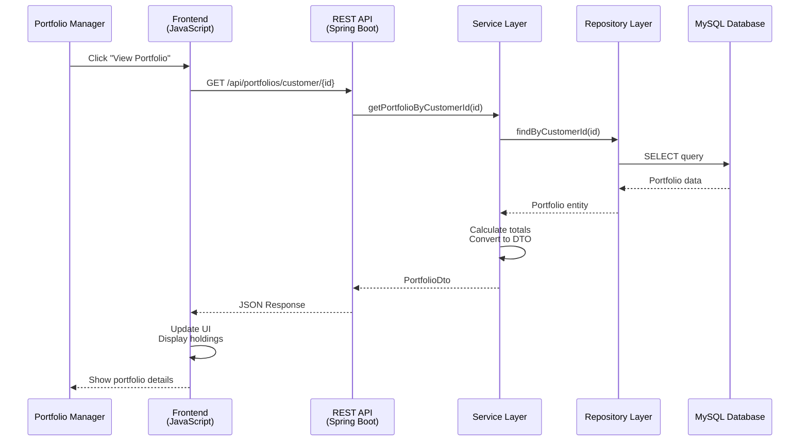
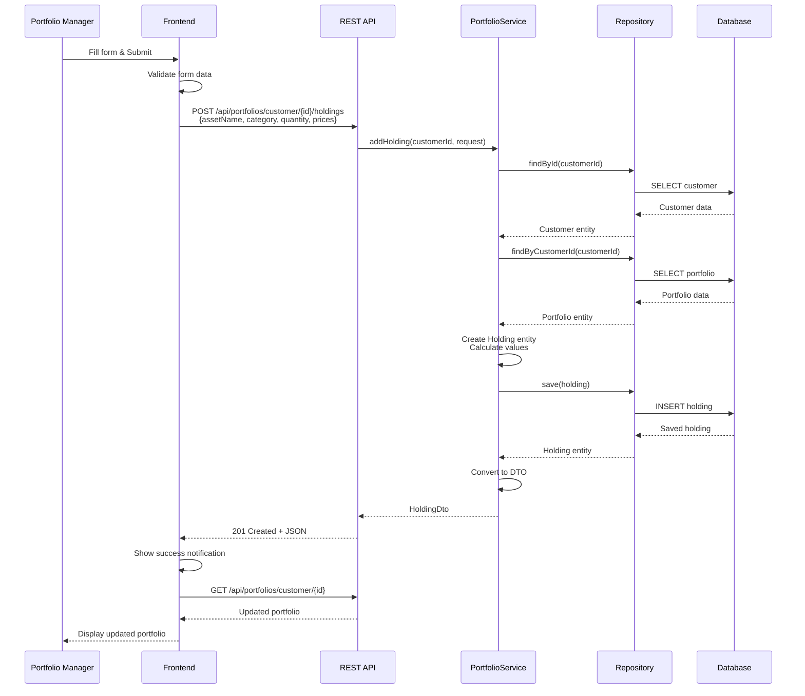
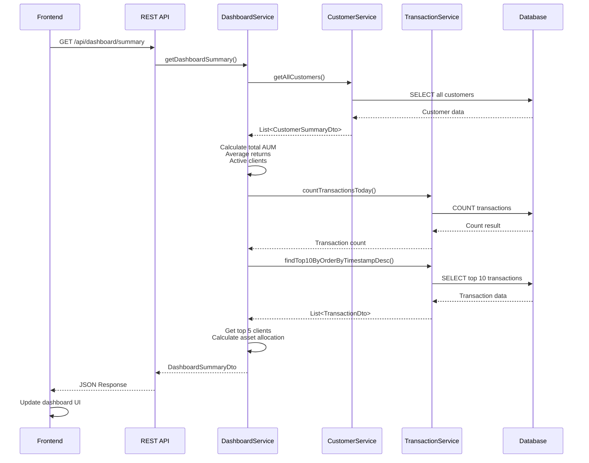
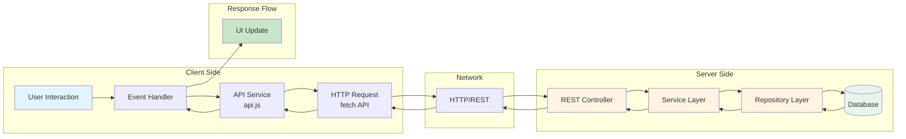

# Client Interaction Diagram

## System Interaction Overview



## Add Holding Sequence



## Dashboard Summary Sequence



## Client-Server Communication Flow



## API Request/Response Pattern

```
┌─────────────────────────────────────────────────────────────┐
│                    REQUEST FLOW                              │
├─────────────────────────────────────────────────────────────┤
│                                                              │
│  1. User Action                                             │
│     └─> Click, Form Submit, Page Load                      │
│                                                              │
│  2. Frontend JavaScript (main.js)                           │
│     └─> Event handler triggered                             │
│                                                              │
│  3. API Service (api.js)                                    │
│     └─> Construct API endpoint URL                        │
│     └─> Prepare request payload (if POST/PUT)              │
│                                                              │
│  4. HTTP Request (fetch API)                                │
│     └─> Method: GET/POST/DELETE                             │
│     └─> Headers: Content-Type: application/json            │
│     └─> Body: JSON data (if applicable)                    │
│                                                              │
│  5. REST Controller (Spring Boot)                           │
│     └─> Receive HTTP request                               │
│     └─> Validate request                                    │
│     └─> Map to DTO                                          │
│                                                              │
│  6. Service Layer                                           │
│     └─> Business logic execution                            │
│     └─> Data transformation                                 │
│                                                              │
│  7. Repository Layer                                        │
│     └─> Database query construction                         │
│                                                              │
│  8. Database                                                │
│     └─> Execute SQL query                                   │
│                                                              │
└─────────────────────────────────────────────────────────────┘

┌─────────────────────────────────────────────────────────────┐
│                   RESPONSE FLOW                              │
├─────────────────────────────────────────────────────────────┤
│                                                              │
│  8. Database                                                │
│     └─> Return query results                                │
│                                                              │
│  7. Repository Layer                                        │
│     └─> Map to Entity objects                              │
│                                                              │
│  6. Service Layer                                           │
│     └─> Convert Entity to DTO                              │
│     └─> Apply business rules                               │
│                                                              │
│  5. REST Controller                                        │
│     └─> Serialize DTO to JSON                              │
│     └─> Set HTTP status code                                │
│                                                              │
│  4. HTTP Response                                           │
│     └─> Status: 200 OK / 201 Created / 204 No Content      │
│     └─> Body: JSON data                                    │
│                                                              │
│  3. API Service                                             │
│     └─> Parse JSON response                                 │
│     └─> Handle errors                                       │
│                                                              │
│  2. Frontend JavaScript                                     │
│     └─> Update UI with received data                        │
│     └─> Show notifications                                  │
│                                                              │
│  1. User                                                    │
│     └─> See updated interface                               │
│                                                              │
└─────────────────────────────────────────────────────────────┘
```
