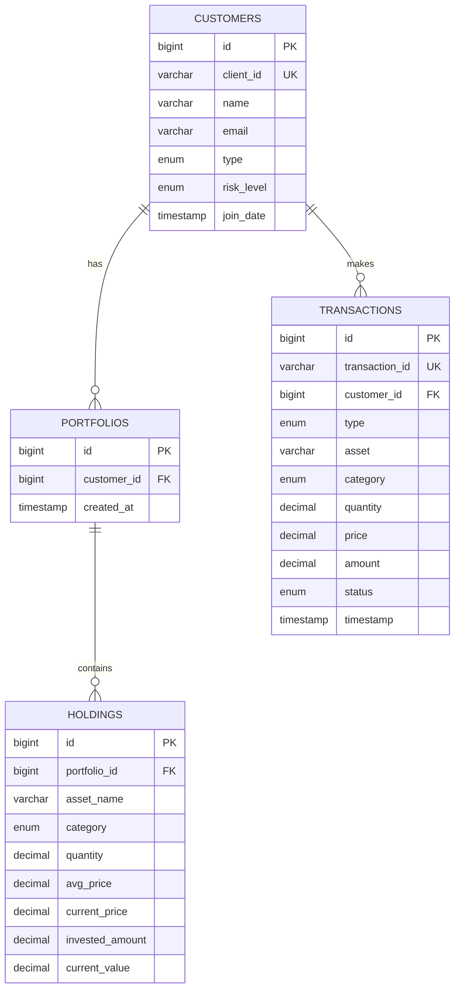

# ER Diagram

## Relationship Details

- **Customer → Portfolio**: One-to-Many (One customer can have multiple portfolios)
- **Customer → Transaction**: One-to-Many (One customer can have multiple transactions)
- **Portfolio → Holding**: One-to-Many (One portfolio can have multiple holdings)

## Asset Categories

- EQUITY
- DEBT
- GOLD
- REAL_ESTATE
- CRYPTO
- CASH
- MUTUAL_FUND

## Customer Types

- HNW (High Net Worth)
- REGULAR

## Risk Levels

- LOW
- MODERATE
- HIGH

## Transaction Types

- BUY
- SELL

## Transaction Status

- SUCCESS
- PENDING
- FAILED
